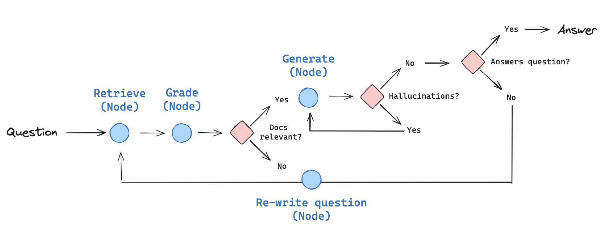
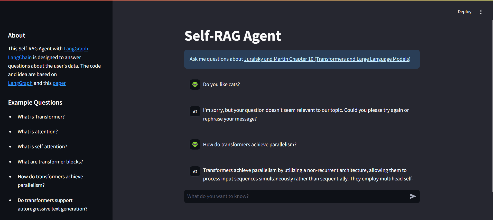

## LangGraph-Self-RAG-Agent    
(LangGRAPH, LangChain, FastAPI, Streamlit, Chroma Vector DB, Docker)

This project implements a self-reflective AI RAG Agent system.   
It includes mechanisms for self-reflection and self-grading on both retrieved documents and generated responses. If the generated answer is deemed unsatisfactory or contains hallucinations, the original query is rewritten, and the process repeats until a satisfactory result is achieved, or a maximum iteration limit is reached.  
The code builds upon code and ideas from the **[LangGraph Tutorial](https://langchain-ai.github.io/langgraph/tutorials/rag/langgraph_self_rag/)** with my own modifications and interpretations.    
The core concept is inspired by the October 2023 paper: **[Self-RAG: Learning to Retrieve, Generate, and Critique through Self-Reflection](https://arxiv.org/abs/2310.11511)**.

  
Picture from [Link](https://langchain-ai.github.io/langgraph/tutorials/rag/langgraph_self_rag/)  

For run:

1. add .env file to /backend  

OPENAI_API_KEY = 'your_OPENAI_API_KEY'  
LANGCHAIN_API_KEY = ''  
USER_AGENT = "DefaultLangchainUserAgent"  
MODEL = 'for example gpt-4o-mini'  
EMBED_MODEL = 'for example text-embedding-3-small'  
CHROMA_DB_PATH = 'for example vector-db'  

2. add your chroma DB: /backend/vector-db  

3. docker-compose up --build

